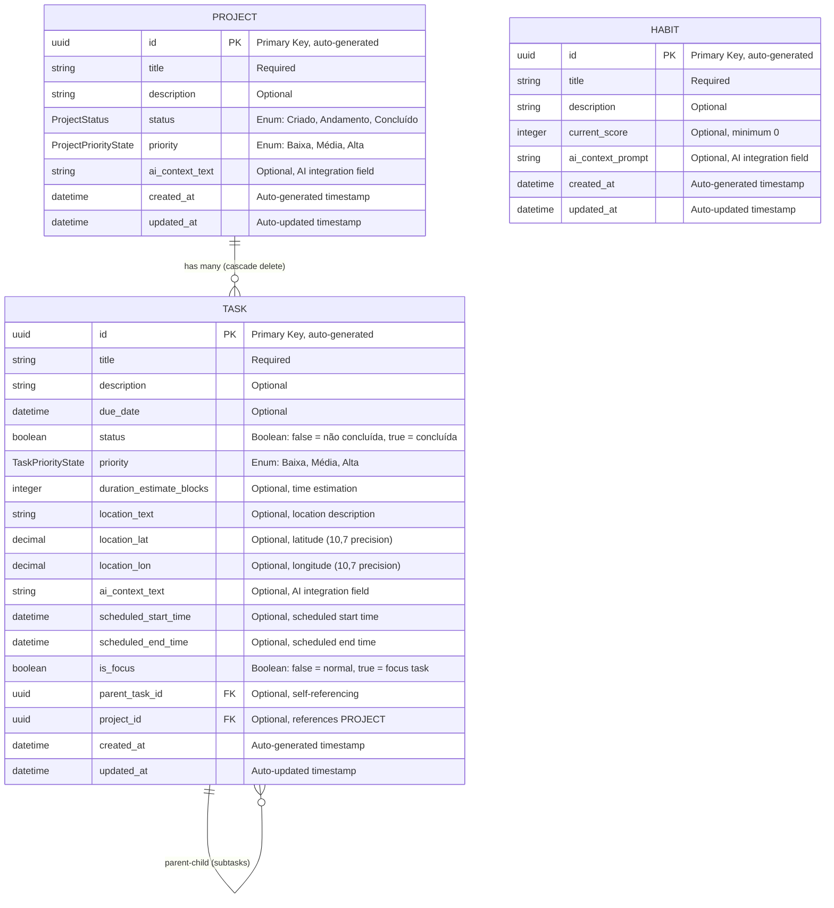

# Database Entity Relationship Diagram

This document contains the Mermaid ERD diagram for the TimeBeing Backend database structure.

## Database Schema

## Relationship Details

### Project → Task (One-to-Many)
- **Relationship**: One project can have multiple tasks
- **Foreign Key**: `task.project_id` references `project.id`
- **Cascade**: Deleting a project deletes all associated tasks
- **Optional**: Tasks can exist without being assigned to a project

### Task → Task (Self-Referencing, One-to-Many)
- **Relationship**: One task can have multiple subtasks
- **Foreign Key**: `task.parent_task_id` references `task.id` (self-referencing)
- **Cascade**: Deleting a parent task deletes all subtasks
- **Optional**: Tasks can exist without being subtasks

### Habit (Independent)
- **No relationships**: Habits are standalone entities
- **No foreign keys**: Completely independent from projects and tasks

## Field Details

### Enums
- **ProjectStatus**: "Criado", "Andamento", "Concluído"
- **ProjectPriorityState**: "Baixa", "Média", "Alta"
- **TaskPriorityState**: "Baixa", "Média", "Alta"

### Timestamps (TimestampMixin)
All entities inherit timestamp fields:
- `created_at`: Automatically set on creation
- `updated_at`: Automatically updated on modification

### UUID Primary Keys
All entities use UUID for primary keys:
- Auto-generated using `uuid.uuid4()`
- Provides globally unique identifiers
- Better for distributed systems and security

### Precision Fields
- **Location coordinates**: Decimal(10,7) for GPS precision
- **Current score**: Integer with minimum value of 0

### AI Integration Fields
All entities have AI context fields for future AI integration:
- **Project**: `ai_context_text`
- **Task**: `ai_context_text`
- **Habit**: `ai_context_prompt`